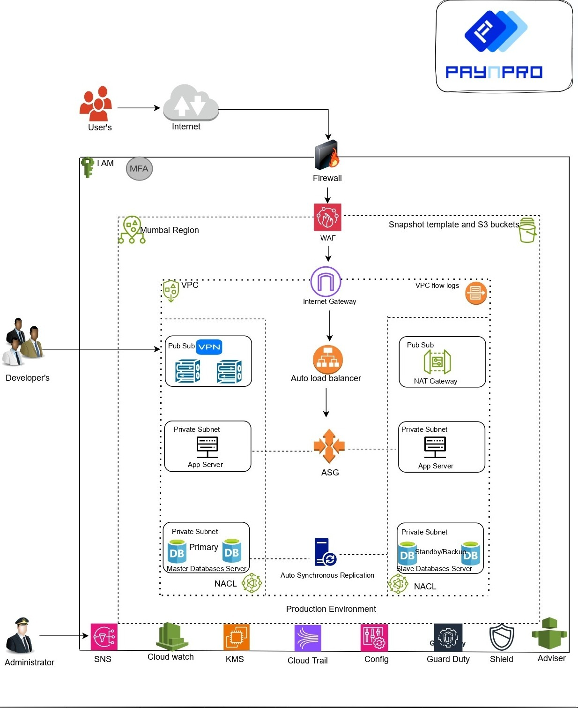

# Terraform AWS Project
This repository contains Terraform code to provision and manage resources on AWS. The main resources included are:

- Virtual Private Cloud (VPC)
- Subnets (public and private)
- Internet Gateway
- NAT Gateway
- Route Tables
- Security Groups
- EC2 Instances
- Auto Scaling Groups
- Load Balancers
- RDS Instances
- S3 Buckets

The architecture diagram above illustrates the infrastructure setup provisioned by this Terraform code. It includes a VPC with public and private subnets, an Internet Gateway, a NAT Gateway, Route Tables, Security Groups, EC2 instances, Auto Scaling Groups, Load Balancers, RDS instances, and S3 buckets.

## Prerequisites

- Terraform installed (version 0.14 or later)
- AWS account and credentials configured

## Usage

1. Clone this repository
2. Navigate to the directory containing the Terraform code
3. Run `terraform init` to initialize the working directory
4. Run `terraform plan` to see the execution plan
5. Run `terraform apply` to apply the changes and create the resources
